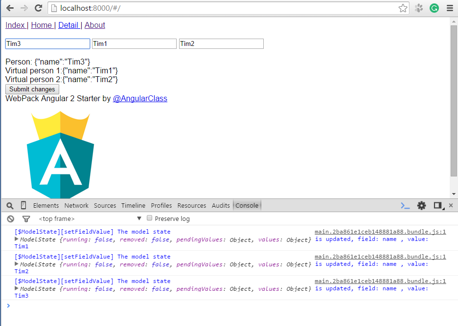
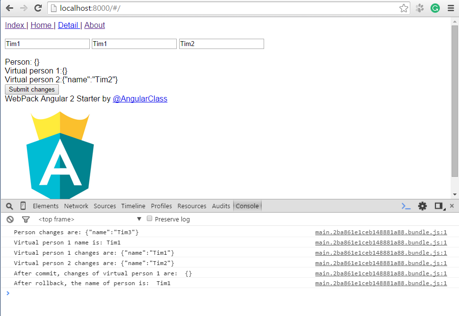
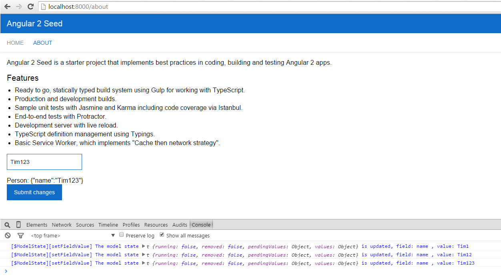

# ts-models

An implementation of models at TypeScript 2.0.  

## Features

1. **Virtual models** - lightweight clone of the target instance without a deep clone of the attributes of the original model. The models have own state.     
2. Support a [Flux](https://facebook.github.io/flux/docs/overview.html) application architecture (state: running, pending values, etc).  
3. Full **Angular 2.0.0 two-way binding** compatible.  
4. Basic methods supported, such as **commit**, **rollback**, **getFieldValue**, **setFieldValue**, **toJSON**, etc.  

## Dependencies

* [core-js](https://www.npmjs.com/package/core-js)  
* [ts-smart-logger](https://www.npmjs.com/package/ts-smart-logger)  
* [ts-immutable-helper](https://www.npmjs.com/package/ts-immutable-helper)  
* [ts-metadata-helper](https://www.npmjs.com/package/ts-metadata-helper)  

## Installation

First you need to install the npm module:
```sh
npm install ts-models --save
```

## Use case #1

Some main methods are present in the model:  

1. **toJSON** - returns the unmodifiable snapshot of original attributes.  
2. **toAttributes** - returns the modifiable snapshot of attributes with the changes if they exist (for binding at the Angular2 templates).  
3. **commit** - it must be called after the synchronization of client-server.  
4. **getChanges** - returns the unmodifiable snapshot of the changes of the original attributes.  
  
```typescript
import {Model} from 'ts-models/index';

export interface IPerson {
    id:number;
    name:string;
    sex:string;
}

export class Person extends Model<IPerson> {

    constructor(protected attributes:IPerson) {
        super(attributes);
    }
}
```

```typescript
import {Component} from '@angular/core';

import {Person, IPerson} from '../models';

@Component(...)
export class Home {

    private person:Person = new Person({
        id: 1,
        name: 'Tim',
        sex: 'men'
    });

    private _virtualPerson1:Person;
    private _virtualPerson2:Person;

    private _virtualPerson1Fields:IPerson;
    private _virtualPerson2Fields:IPerson;
    private _personAttributes:IPerson;

    get personAttributes():IPerson {
        return this._personAttributes = this._personAttributes || this.person.toAttributes();
    }

    get virtualPerson1():Person {
        return this._virtualPerson1 = this._virtualPerson1 || this.person.toVirtualModel<Person>();
    }

    get virtualPerson2():Person {
        return this._virtualPerson2 = this._virtualPerson2 || this.person.toVirtualModel<Person>();
    }

    get virtualPerson1Attributes():IPerson {
        return this._virtualPerson1Fields = this._virtualPerson1Fields || this.virtualPerson1.toAttributes();
    }

    get virtualPerson2Attributes():IPerson {
        return this._virtualPerson2Fields = this._virtualPerson2Fields || this.virtualPerson2.toAttributes();
    }

    constructor(public title:Title) {
    }

    modelToString(model:IPerson):string {
        return JSON.stringify(model);
    }

    submitChanges() {
        console.log('Person changes are:', this.modelToString(this.person.getChanges()));

        console.log('Virtual person 1 name is:', this.virtualPerson1.getFieldValue('name'));
        console.log('Virtual person 1 changes are:', this.modelToString(this.virtualPerson1.getChanges()));
        console.log('Virtual person 2 changes are:', this.modelToString(this.virtualPerson2.getChanges()));

        this.virtualPerson1.start();        // Open transaction
        this.virtualPerson1.commit();       // Commit transaction
        console.log('After commit, changes of virtual person 1 are: ', this.modelToString(this.virtualPerson1.getChanges()));

        this.person.start();                // Open transaction
        this.person.rollback();             // Rollback transaction
        console.log('After rollback, the name of person is: ', this.person.getFieldValue('name'));
    }
}
```

```html
<form (ngSubmit)="submitChanges()" autocomplete="off">
  <br>
  <input type="text" [(ngModel)]="personAttributes.name" [ngModelOptions]="{standalone: true}"/>
  <input type="text" [(ngModel)]="virtualPerson1Attributes.name" [ngModelOptions]="{standalone: true}"/>
  <input type="text" [(ngModel)]="virtualPerson2Attributes.name" [ngModelOptions]="{standalone: true}"/><br>
  <br>
  Person: {{ modelToString(person.getChanges()) }}<br>
  Virtual person 1:{{ modelToString(virtualPerson1.getChanges()) }}<br>
  Virtual person 2:{{ modelToString(virtualPerson2.getChanges()) }}<br>

  <button>Submit changes</button>
</form>
```

  
  

## Use case #2

You can also use the **@ViewField** and **@ViewSourceModel** annotations.  

```typescript
import {Component} from '@angular/core';

import {Model, ViewSourceModel, ViewField} from 'ts-models/index';

export interface IPerson {
    id:number;
    name:string;
    sex:string;
}

export class Person extends Model<IPerson> {

    constructor(protected attributes:IPerson) {
        super(attributes);
    }
}

@Component(...)
export class AboutComponent {

    private _person:Person = new Person({
        id: 1,
        name: 'Tim',
        sex: 'men'
    });

    @ViewField()
    private name:string;

    @ViewSourceModel()
    get viewPerson():Person {
        return this._person;
    }

    modelToString(model:IPerson):string {
        return JSON.stringify(model);
    }

    submitChanges() {
        console.log('Person changes are:', this.modelToString(this._person.getChanges()));

        this._person.start();                // Open transaction
        this._person.rollback();             // Rollback transaction
        console.log('After rollback, the name of person is: ', this._person.getFieldValue('name'));
    }
}
```

```html
<form (ngSubmit)="submitChanges()" autocomplete="off">
  <br>
  <input type="text" [(ngModel)]="name" [ngModelOptions]="{standalone: true}"/><br>
  <br>
  Person: {{ modelToString(viewPerson.getChanges()) }}<br>
  <button>Submit changes</button>
</form>
```

  

## Publish

```sh
npm run deploy
```

## License

Licensed under MIT.